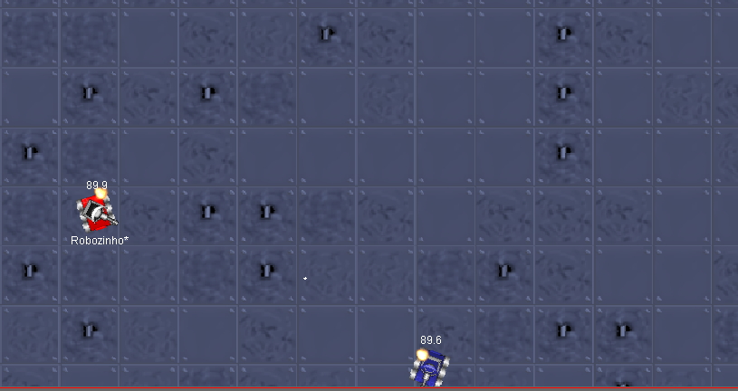
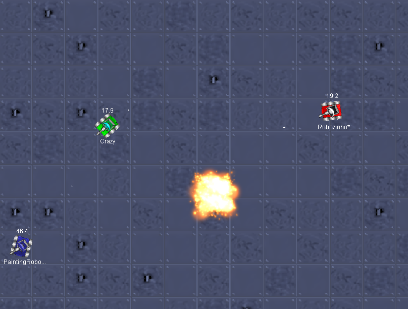
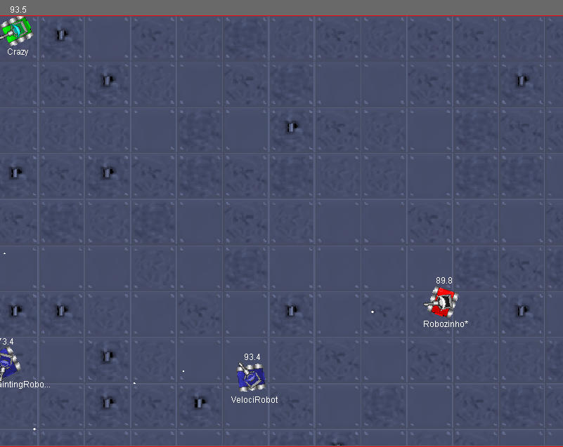
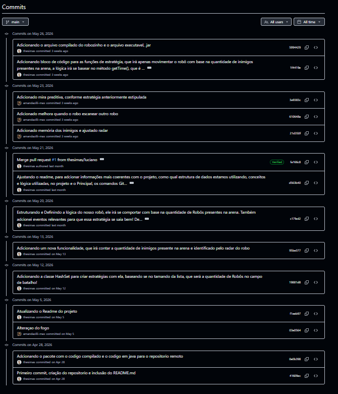

# 🤖 Robozinho - Robocode & Versionamento

**Disciplina:** ICO7862 - Introdução a Computação  
**Professor:** Diego da Silva de Medeiros  
**Alunos:** Amanda A. Zilli e Luciano Simas Junior

---

## 1. Introdução
O Robocode é um jogo de programação onde o objetivo é desenvolver um robô em Java para batalhar em uma arena virtual. Neste projeto, construímos o nosso robô, chamado **Robozinho**.

No entanto, o **grande foco** da nossa atividade não foi focar estritamente em aprender a programar Orientado a Objetos do zero, mas sim utilizar esse desenvolvimento como base para **aprender na prática o controle de versão**. Usamos as ferramentas Git e GitHub ao longo de todo o processo para versionar o código, registrar nossa evolução e compartilhar o repositório de forma colaborativa.

## 2. Objetivos da Atividade
* Desenvolver um robô funcional com base em uma estratégia combinada em grupo.
* Aprender o funcionamento básico dos eventos do Robocode.
* **Compreender e se familiarizar com a plataforma do GitHub** para armazenamento e controle do projeto.
* **Entender na prática o funcionamento e o fluxo de branches, commits e pull requests**.

## 3. Descrição da Atividade
Inicialmente, definimos a estratégia do nosso robô: ele foi programado para reagir de maneiras diferentes dependendo da quantidade de inimigos vivos na arena. 

A mágica do trabalho em equipe aconteceu no código. Cada integrante estudava, desenvolvia e adicionava trechos de código de forma individual. Nos encontros presenciais, discutíamos o que seria mantido e utilizávamos o Git para registrar essas modificações de forma segura. O GitHub foi a ponte que utilizamos para conciliar o repositório, permitindo que trabalhássemos juntos sem quebrar a aplicação.

## 4. Estrutura do Git Utilizada
O Git foi o nosso motor para armazenar o código-fonte localmente, enquanto o GitHub funcionou como o repositório remoto.

* **Repositório:** Criado no GitHub para centralizar o projeto e permitir a colaboração.
* **Commits:** O foco foi escrever mensagens claras a cada commit. Isso facilitou muito a visualização do histórico e o entendimento do que foi adicionado ou alterado por cada um.
* **Branches e Pull Requests:** Ramificamos o código para desenvolver lógicas isoladas e, quando prontas, integrávamos à versão principal de forma organizada.

## 5. Resultados e Aprendizados
Esse projeto foi um marco muito importante para nós. Mais do que entender a lógica do jogo, o nosso aprendizado real foi colocar em prática os conceitos de versionamento de código. 

Enfrentamos os desafios iniciais de gerenciar um projeto colaborativo, mas superamos isso ganhando uma familiaridade muito maior com o Git e o GitHub. Aprender a manter o histórico organizado e a fazer o "merge" do código nos preparou para lidar com fluxos de trabalho reais na área de tecnologia.

## 6. Conclusão
O desenvolvimento do "Robozinho" cumpriu seu papel em reforçar nossa lógica de programação em Java. Contudo, a lição mais valiosa foi entender como as ferramentas Git e GitHub são indispensáveis para registrar alterações, organizar o projeto e manter o histórico completo das modificações, viabilizando o trabalho em equipe.

---

## 7. Anexos

Abaixo, documentamos o comportamento do nosso robô em ação na arena e o fluxo de versionamento que mantivemos:

### 📍 O Robozinho na Arena

[cite: 2]
> *Robozinho operando em combate singular, fazendo a leitura do inimigo pelo radar.*

[cite: 2]
> *O robô calculando posições e abrindo fogo contra adversários em movimento.*

[cite: 2]
> *Nosso robô adaptando a estratégia de movimentação ao identificar uma arena com múltiplos inimigos.*

### 🌳 Nosso Histórico de Versionamento

[cite: 2]
> *Print do nosso histórico no GitHub, detalhando a rotina de commits, evolução do projeto e o trabalho da equipe.*